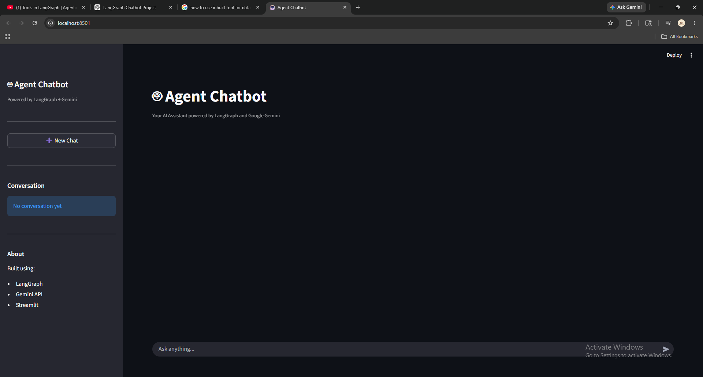
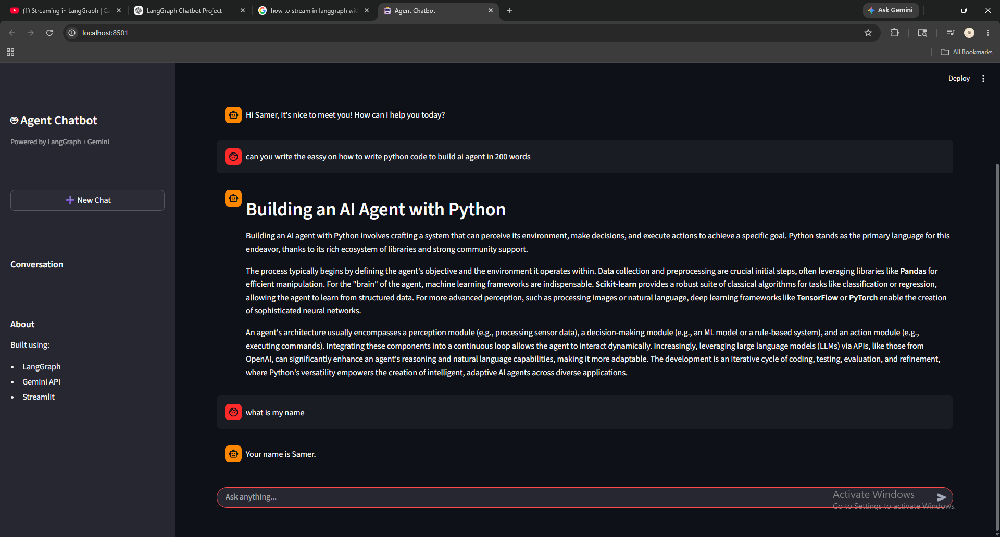

# 🤖 Agent Chatbot

A conversational AI chatbot built using **LangGraph**, **Google Gemini**, and **Streamlit**. The chatbot supports conversation memory, response streaming, and tool calling capabilities.

---

## 🚀 Features

✅ Google Gemini Integration

✅ LangGraph Workflow

✅ Conversation Memory

✅ Real-Time Streaming Responses

✅ Streamlit Chat Interface

✅ Tool Calling Support

✅ Calculator Tool

✅ Date & Time Tool

--- 

## 📸 Application Preview



### Memory Example



## 🛠️ Tech Stack

- LangGraph
- LangChain
- Google Gemini API
- Streamlit
- Python
- LangSmith (Optional)

---

## 📂 Project Structure

```text
agent-chatbot/
│
├── app.py              # Streamlit UI
├── graph.py            # LangGraph workflow
├── state.py            # Chat state definition
├── tools.py            # Tools used by the agent
├── nodes.py            # Custom nodes (optional)
├── requirements.txt
├── .env
└── README.md
```

---

## 🧠 Architecture

```text
START
  ↓
Chatbot Node
  ↓
Tool Required?
 ↙         ↘
Yes         No
 ↓           ↓
Tool Node    END
 ↓
Chatbot Node
```

The LLM decides whether a tool is required.

If a tool is needed:

1. Gemini creates a tool call
2. ToolNode executes the tool
3. Tool result is returned to Gemini
4. Gemini generates the final answer

---

## ⚙️ Installation

### Clone Repository

```bash
git clone https://github.com/samer-shaikh/agent-chatbot.git

cd agent-chatbot
```

### Create Virtual Environment

```bash
python -m venv venv
```

Activate:

```bash
venv\Scripts\activate
```

### Install Dependencies

```bash
pip install -r requirements.txt
```

---

## 🔑 Environment Variables

Create a `.env` file:

```env
GOOGLE_API_KEY=your_api_key_here
```

---

## ▶️ Run Application

```bash
streamlit run app.py
```

---

## 🔧 Available Tools

### Calculator Tool

Example:

```text
What is 25 * 8?
```

Output:

```text
200
```

---

### Date Tool

Example:

```text
What is the current date?
```

Output:

```text
2026-05-30 12:45:21
```

---

## 📸 Demo

### Memory Example

```text
User: My name is Samer

Assistant: Nice to meet you Samer!

User: What is my name?

Assistant: Your name is Samer.
```

---

## 🎯 Future Improvements

- Web Search Tool
- YouTube Research Tool
- PDF Chat
- RAG Pipeline
- Multi-Agent System
- Voice Input
- Voice Output
- Chat History Database
- User Authentication

---

## 📈 Learning Outcomes

This project demonstrates:

- LangGraph Fundamentals
- State Management
- Checkpointers
- Tool Calling
- Streaming Responses
- Agent Architecture
- Conversation Memory

---

## 👨‍💻 Author

**Samer Shaikh**

Learning AI Engineering, LangGraph, Machine Learning, and Agentic AI.

GitHub:
[(see profile)](https://github.com/samer-shaikh)

LinkedIn:
[(see profile)](https://www.linkedin.com/in/samer-shaikh-427668320/)

---

## ⭐ If you found this project useful

Give the repository a star and follow my AI journey!